# Hotel Restaurant Controller - Complete Sequence Diagram

```mermaid
sequenceDiagram
    autonumber
    participant User
    participant Browser
    participant View as Blade View
    participant Controller as HotelRestaurantController
    participant Models as Models (Restaurant, Meal, Hotel, etc.)
    participant DB as Database
    participant CommonHelper
    participant AzureStorage

    rect rgb(240, 248, 255)
        Note over User,AzureStorage: 🍽️ PHASE 1: RESTAURANT LISTING
        
        rect rgb(255, 250, 240)
            Note over User,AzureStorage: List Restaurants
            User->>Browser: Navigate to /restaurants
            Browser->>Controller: GET index()
            Controller->>Controller: Get user role
            Controller->>Controller: Resolve DMC hierarchy based on role
            alt Role 4 (Assistant Manager)
                Controller->>Models: Query Restaurant WHERE<br/>status IN (4, 5, 1)
            else Role 3 (Manager)
                Controller->>Models: Query Restaurant WITH hotel<br/>WHERE status IN (5, 1)
            else Role 1, 2, 23 (Admin)
                Controller->>Models: Query Restaurant WITH hotel<br/>WHERE status IN (1, 3)
            else Role 10, 19 (Master DMC)
                Controller->>Models: Query Restaurant WHERE<br/>dmc_id IN (master_dmc_ids)
            else Role 11, 20 (DMC)
                Controller->>Models: Query Restaurant WITH hotel<br/>WHERE dmc_id = userId
            else Role 25, 63, 119 (Product Head/Manager)
                Controller->>Controller: Resolve master_dmc_id
                Controller->>Models: Query Restaurant WHERE<br/>dmc_id IN (dmc_ids)
            else Other Roles
                Controller->>Models: Query Restaurant WHERE<br/>dmc_id = created_by
            end
            Models->>DB: SELECT restaurants
            DB-->>Models: Restaurants list
            Models-->>Controller: Restaurants collection
            Controller-->>Browser: Return restaurant view
            Browser->>View: Render restaurants table
        end
    end

    rect rgb(255, 250, 240)
        Note over User,AzureStorage: 🏨 PHASE 2: RESTAURANT CREATION (FROM HOTEL)
        
        rect rgb(240, 255, 240)
            Note over User,AzureStorage: Create Restaurant Form
            User->>Browser: Navigate to /hotels/{id}/create-restaurant
            Browser->>Controller: GET create($id)
            Controller->>Controller: Check permission: 'create restaurant'
            Controller->>Models: Find Hotel by hotel_unique_id
            Controller->>Controller: Get user type & resolve hotels
            Controller->>Controller: Resolve DMC ID:<br/>- Admin: from request or hotel<br/>- DMC: from auth user
            Controller->>Models: Find User (DMC) by userId
            Controller->>Models: Query Restaurant WHERE owned_by = hotel_id
            Controller->>Models: Query City WHERE country = userCountry
            Controller->>Controller: Get available DMCs (for admin)
            Controller-->>Browser: Return add-hotel-restaurant view
            Browser->>View: Render restaurant creation form<br/>with hotel context
            
            User->>View: Fill restaurant form & submit
            View->>Browser: POST /hotels/store-restaurant
            Browser->>Controller: store()
            Controller->>Controller: Validate request data
            Controller->>Controller: Reset meal fields if not available<br/>(breakfast, lunch, dinner)
            Controller->>CommonHelper: Generate restaurant_id
            Controller->>Controller: Process gallery images (all_images)
            loop For each image
                Controller->>CommonHelper: image_path('file_storage', image)
                CommonHelper->>AzureStorage: Upload to Azure
                AzureStorage-->>CommonHelper: Image URL
            end
            Controller->>Controller: Process master_image
            Controller->>CommonHelper: image_path('file_storage', master_image)
            Controller->>Controller: Resolve DMC ID based on role:<br/>- Role 35, 77, 84: from hierarchy<br/>- Role 11: from auth user<br/>- Admin: from request
            Controller->>Controller: Check for duplicate restaurant<br/>at same lat/lng for DMC
            alt Duplicate found
                Controller-->>Browser: Error: Restaurant exists at location
            else No duplicate
                Controller->>Models: Restaurant::create([<br/>name, city, country,<br/>latitude, longitude, cuisine,<br/>breakfast_available, lunch_available,<br/>dinner_available, meal times,<br/>meal prices, owned_by (hotel_id),<br/>images, master_image,<br/>dmc_id, status, description,<br/>terms_conditions, remarks])
                Models->>DB: INSERT INTO restaurants
                DB-->>Models: Restaurant created
                Models-->>Controller: Restaurant instance
                Controller-->>Browser: Redirect to meals creation
                Browser->>View: Show success message
            end
        end
    end

    rect rgb(240, 255, 240)
        Note over User,AzureStorage: ✏️ PHASE 3: RESTAURANT EDITING
        
        rect rgb(255, 250, 240)
            Note over User,AzureStorage: Edit Restaurant Form
            User->>Browser: Navigate to /restaurants/{id}/edit
            Browser->>Controller: GET edit($id)
            Controller->>Models: Find Restaurant by restaurant_id
            Controller->>Models: Query Hotel WHERE status = 1
            Controller->>Models: Query Meal grouped by type
            Controller->>Models: Query Country & City
            Controller->>Controller: Resolve DMC users (for admin)
            Controller-->>Browser: Return edit-hotel-restaurant view
            Browser->>View: Render edit form with restaurant data
            
            User->>View: Update restaurant & submit
            View->>Browser: PUT /restaurants/{id}
            Browser->>Controller: update($id)
            Controller->>Controller: Reset meal fields if not available
            Controller->>Controller: Handle existing images
            Controller->>Controller: Process new gallery images
            loop For each new image
                Controller->>CommonHelper: image_path('file_storage', image)
                CommonHelper->>AzureStorage: Upload image
            end
            Controller->>Controller: Merge existing + new images
            Controller->>Controller: Handle master_image<br/>(keep existing or upload new)
            Controller->>Models: Restaurant::update([<br/>name, city, coordinates,<br/>cuisine, meal availability,<br/>meal times, meal prices,<br/>images, master_image,<br/>description, terms, remarks])
            Models->>DB: UPDATE restaurants
            DB-->>Models: Restaurant updated
            Controller-->>Browser: Redirect to restaurant list
            Browser->>View: Show success message
        end

        rect rgb(240, 255, 255)
            Note over User,AzureStorage: Delete Restaurant
            User->>Browser: Click delete restaurant
            Browser->>Controller: DELETE /restaurants/{id}
            Controller->>Controller: destroy($id)
            Controller->>Models: Check if used in Room table<br/>(breakfast_restaurant, lunch_restaurant,<br/>dinner_restaurant)
            alt Restaurant used in rooms
                Controller-->>Browser: Error: Restaurant in use
            else Restaurant not used
                Controller->>Models: Restaurant::delete()
                Models->>DB: DELETE FROM restaurants
                Controller-->>Browser: Redirect to restaurant list
                Browser->>View: Show success message
            end
        end
    end

    rect rgb(255, 240, 255)
        Note over User,AzureStorage: 📅 PHASE 4: RESTAURANT CALENDAR
        
        rect rgb(240, 255, 240)
            Note over User,AzureStorage: Restaurant Calendar
            User->>Browser: Navigate to /restaurants/{id}/calendar
            Browser->>Controller: GET restaurantCalendar($restaurant_id)
            Controller->>Models: Find Restaurant by restaurant_id
            Controller->>Controller: Get close_days & close_dates
            Controller-->>Browser: Return calendar view
            Browser->>View: Render calendar interface
            
            User->>View: Set close days & holiday dates
            View->>Browser: POST /restaurants/close-date
            Browser->>Controller: restaurantCloseDate()
            Controller->>Controller: Parse holiday dates string<br/>(comma-separated)
            Controller->>Controller: Convert to JSON array
            Controller->>Models: Restaurant::update([<br/>close_days, close_dates])
            Models->>DB: UPDATE restaurants
            Controller-->>Browser: Redirect back with success
        end
    end

    rect rgb(240, 248, 255)
        Note over User,AzureStorage: 🍽️ PHASE 5: MEAL MANAGEMENT
        
        rect rgb(255, 250, 240)
            Note over User,AzureStorage: Meals Creation Page
            User->>Browser: Navigate to /hotels/{hotel_id}/meals-create<br/>?dmc_id={dmc_id}&restaurant_id={id?}
            Browser->>Controller: GET mealsCreate($dmc_id, $hotel_id)
            Controller->>Controller: Check permission: 'create meal'
            Controller->>Models: Find Hotel by hotel_unique_id
            Controller->>Controller: Get user role
            alt Admin (role 1, 20)
                Controller->>Models: Query User WHERE role_id IN (11, 20)
                Controller->>Controller: Handle DMC selection<br/>(dmc_id = 0 or invalid)
            else Regular DMC
                Controller->>Models: Find User (DMC) by dmc_id
            end
            Controller->>Controller: Resolve filter DMC ID
            alt Restaurant ID provided
                Controller->>Models: Find Restaurant WHERE<br/>restaurant_id = ? AND owned_by = hotel_id
                Controller->>Controller: Verify user access to restaurant
                Controller->>Models: Query Meal WHERE<br/>restaurant_id = ? AND dmc_id = filterDmcId
            else No restaurant ID
                alt Admin
                    Controller->>Models: Query Restaurant WHERE<br/>owned_by = hotel_id AND is_active = 1
                else DMC
                    Controller->>Models: Query Restaurant WHERE<br/>owned_by = hotel_id AND<br/>whereJsonContains('dmc_id', userId)
                end
                Controller->>Models: Query Meal WHERE<br/>restaurant_id IN (...) AND dmc_id = filterDmcId
            end
            Controller-->>Browser: Return add-meals view
            Browser->>View: Render meals management interface<br/>with restaurants & meals list
        end

        rect rgb(240, 255, 240)
            Note over User,AzureStorage: Create Meal
            User->>View: Fill meal form & submit
            View->>Browser: POST /hotels/store-meal
            Browser->>Controller: mealStore()
            Controller->>Controller: Validate request
            Controller->>Controller: Check DMC selection (for admin)
            Controller->>CommonHelper: Generate meal_id
            Controller->>Controller: Process item_file (image)
            Controller->>CommonHelper: image_path('file_storage', file)
            CommonHelper->>AzureStorage: Upload meal image
            Controller->>Controller: Set DMC ID:<br/>- Admin: from request<br/>- DMC: from auth user
            Controller->>Models: Meal::create([<br/>meal_id, name, restaurant_id,<br/>item_description, type,<br/>meal_period (1=Breakfast, 2=Lunch, 3=Dinner),<br/>price, adult_price, child_price,<br/>category, files (image),<br/>item_type, is_active,<br/>created_by, dmc_id])
            Models->>DB: INSERT INTO meals
            DB-->>Models: Meal created
            Controller-->>Browser: Redirect to meals-create page
            Browser->>View: Show success message
        end

        rect rgb(255, 240, 255)
            Note over User,AzureStorage: Edit Meal
            User->>Browser: Navigate to /meals/{id}/edit
            Browser->>Controller: GET mealEdit($id)
            Controller->>Models: Find Meal by meal_id
            Controller->>Models: Find Restaurant by restaurant_id
            Controller->>Controller: Check user permission:<br/>- Admin: always allowed<br/>- DMC: check if owns restaurant
            alt User not authorized
                Controller-->>Browser: 403 Forbidden
            else User authorized
                Controller->>Models: Query Restaurant WHERE<br/>restaurant_id = ? AND is_active = 1
                Controller-->>Browser: Return edit-meals view
                Browser->>View: Render meal edit form
            end
            
            User->>View: Update meal & submit
            View->>Browser: PUT /meals/{id}
            Browser->>Controller: mealUpdate($id)
            Controller->>Controller: Validate request
            Controller->>Models: Find Meal & Restaurant
            Controller->>Controller: Handle item_file:<br/>- Check remove_image flag<br/>- Upload new if provided<br/>- Keep existing if neither
            Controller->>Controller: Resolve DMC ID from restaurant
            Controller->>Models: Meal::update([<br/>restaurant_id, item_description,<br/>name, type, prices,<br/>category, item_type,<br/>files, meal_period, is_active])
            Models->>DB: UPDATE meals
            Controller-->>Browser: Redirect to meals-create page
            Browser->>View: Show success message
        end

        rect rgb(240, 255, 255)
            Note over User,AzureStorage: Delete Meal
            User->>Browser: Click delete meal
            Browser->>Controller: DELETE /meals/{id}
            Controller->>Controller: mealDestroy($id)
            Controller->>Models: Find Meal & Restaurant
            Controller->>Controller: Check user permission
            Controller->>Controller: Resolve DMC ID & hotel_id
            Controller->>Models: Meal::delete()
            Models->>DB: DELETE FROM meals
            Controller-->>Browser: Redirect to meals-create page
            Browser->>View: Show success message
        end

        rect rgb(255, 250, 240)
            Note over User,AzureStorage: Fetch DMC Meals (AJAX)
            User->>View: Select DMC dropdown (admin only)
            View->>Browser: AJAX GET /hotels/{hotel_id}/fetch-dmc-meals<br/>?dmc_id={dmc_id}
            Browser->>Controller: fetchDmcMeals($hotel_id)
            Controller->>Controller: Validate dmc_id
            Controller->>Models: Query Restaurant WHERE<br/>owned_by = hotel_id AND<br/>whereJsonContains('dmc_id', dmc_id)
            Controller->>Models: Query Meal WHERE<br/>restaurant_id IN (...)
            Controller->>Controller: Map meals data:<br/>- meal_period to text (Breakfast/Lunch/Dinner)<br/>- type to text (Buffet/Set Menu/A-La-Carte)
            Controller->>Controller: Map restaurants data
            Controller-->>Browser: JSON {success, meals, restaurants}
            Browser->>View: Update meals list dynamically
        end
    end
```

## Key Features Covered

### 🔐 **Authentication & Authorization**
- Role-based restaurant access control
- DMC hierarchy resolution (Master DMC, Product Head, Product Manager)
- Permission checks for meal operations
- Restaurant ownership verification

### 🍽️ **Restaurant Management**
1. **List Restaurants**: Complex role-based filtering
   - Admin: All restaurants (status 1, 3)
   - Manager: Pending + approved (status 5, 1)
   - DMC: Own restaurants (dmc_id = userId)
   - Master DMC: All DMC restaurants
   - Product Head/Manager: Filtered by hierarchy

2. **Create Restaurant**: From hotel context
   - Hotel association (owned_by)
   - DMC assignment
   - Meal availability (breakfast, lunch, dinner)
   - Image uploads (master + gallery)
   - Duplicate location check

3. **Edit Restaurant**: 
   - Update meal availability & times
   - Image management (add/remove)
   - Location updates
   - Terms & conditions

4. **Delete Restaurant**: 
   - Usage check (rooms table)
   - Soft delete if not in use

### 📅 **Restaurant Calendar**
- Close days management (weekly)
- Holiday dates (specific dates)
- JSON storage for flexibility

### 🍽️ **Meal Management**
1. **Meal Types**:
   - **Meal Period**: Breakfast (1), Lunch (2), Dinner (3)
   - **Meal Type**: Buffet (1), Set Menu (2), A-La-Carte (3)
   - **Category**: Various meal categories
   - **Item Type**: Optional classification

2. **Pricing**:
   - Base price
   - Adult price
   - Child price

3. **DMC-Specific Meals**:
   - Each DMC has own meals for restaurants
   - Admin can view/manage all DMC meals
   - DMC can only manage own meals

4. **Image Management**:
   - Item file (meal image)
   - Upload to Azure storage
   - Remove image option

### 🔄 **AJAX Operations**
- **Fetch DMC Meals**: Dynamic meal loading for admin
- Real-time restaurant/meal updates
- JSON response format

### 🎨 **Visual Organization**
- Color-coded phases for easy navigation
- Clear separation of restaurant vs meal operations
- Comprehensive flow coverage
- Detailed permission checks

### 📊 **Data Relationships**
- **Hotel → Restaurant**: One-to-many (owned_by)
- **Restaurant → Meal**: One-to-many (restaurant_id)
- **Restaurant → Room**: Many-to-many (breakfast/lunch/dinner_restaurant)
- **DMC → Restaurant**: Many-to-many (dmc_id JSON array)
- **DMC → Meal**: One-to-many (dmc_id)

### 🔍 **Special Features**
- **Duplicate Prevention**: Location-based check (lat/lng + DMC)
- **Usage Validation**: Check restaurant usage before deletion
- **Hierarchical Access**: Complex DMC hierarchy resolution
- **Meal Availability**: Conditional field reset based on availability flags
- **Image Handling**: Azure blob storage integration
